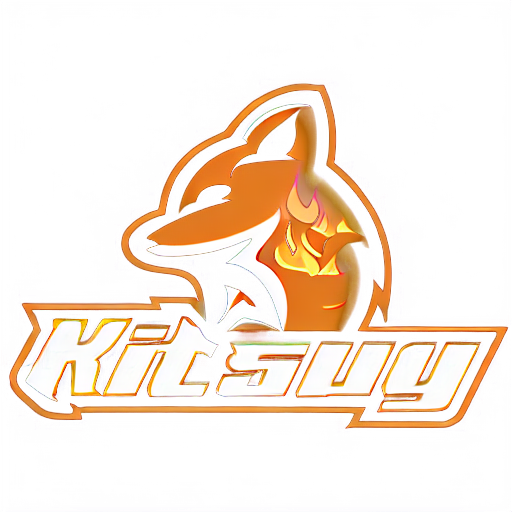

# BGE-KIT (UPBGE 0.2.6 Fork)

BGE-KIT is a community-driven fork of RanGE 1.0, designed for seamless compatibility between the two engines. It's built upon UPBGE 0.2.6.

## Why UPBGE 0.2.6?

We've chosen to maintain UPBGE 0.2.6 due to its:

* **Python 3.7.17 Compatibility:** This allows for the continued use of legacy add-ons originally developed for UPBGE 2.5b.
* **Legacy Logic Nodes:** Retains access to older, logic node system.
* **Easy-Online-V2 Integration:** Provides straightforward online functionality.
* **Enhanced Tooltips:** Menu tooltips for the Game Engine Python API improve usability.

## Community-Driven Development

BGE-KIT is developed and maintained by a team of passionate volunteers. We welcome contributions from users interested in game engine development.

## What's New? (Initial Development)

As a new fork, BGE-KIT is currently in its initial development phase. We are focusing on establishing a stable foundation and incorporating community feedback. Future updates and release notes will detail specific changes and additions. Stay tuned for further announcements!

## Join Us!

We encourage new users to join our community and contribute by:

* Testing current features.
* Reporting bugs.
* Providing feedback and suggestions for improvement.

We look forward to building BGE-KIT together!

